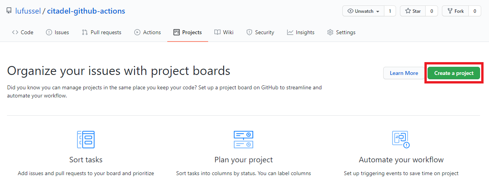
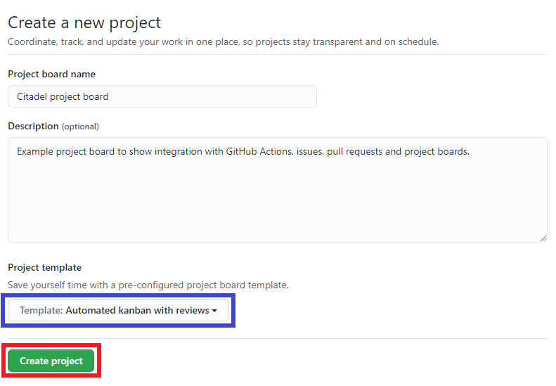
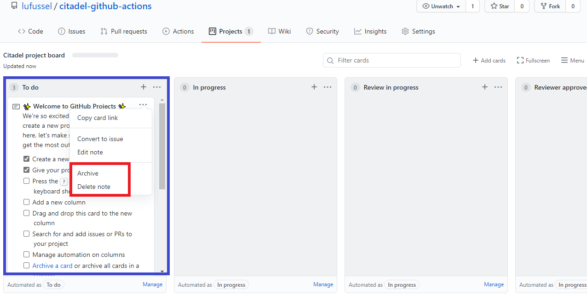
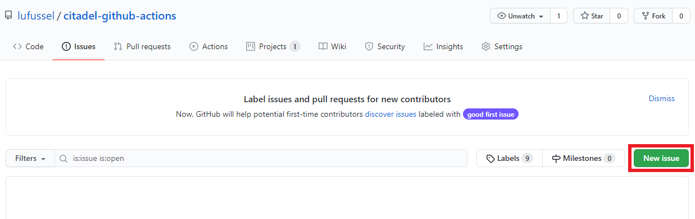
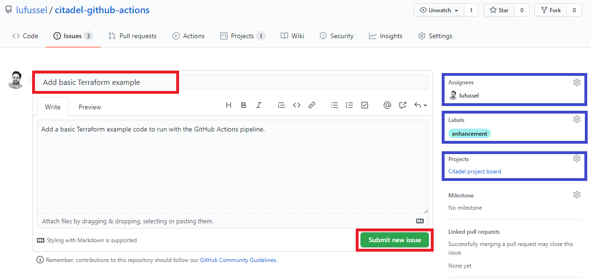
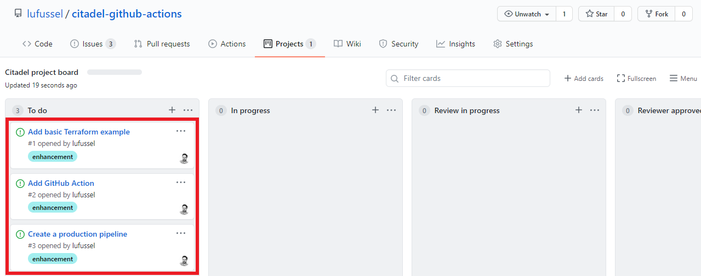

# Create a GitHub project board

## Introduction

GitHub integrates project boards, issues and pull requests to automatically position task status to reflect those *in progress*, *review in progress*, *done* and so on.

In this lab we will create a basic GitHub project board and create some issues to associate with later labs. The issues will demonstrate the GitHub project board integration as we link pull requests to the issues.
 
> Similar integration exists for Azure Boards, see [Link GitHub commits, pull requests and issues to work items](https://docs.microsoft.com/en-us/azure/devops/boards/github/link-to-from-github?view=azure-devops) for more information).

### Create a new GitHub project board

1. From within your GitHub repository, click **Projects**, **Create a project**.

2. Complete the form and click **Create project**.
    - Project board name: `Enter a short name for the repo`
    - Project template: `Template: Automated kanban with reviews`

3. GitHub will redirect to the new project board, the template notes can be safely archived or deleted.

*Learn more at [GitHub Docs - Creating a project board](https://docs.github.com/en/github/managing-your-work-on-github/creating-a-project-board).*

### Create sample issues

Create sample issues to feed into the project board and pull request integration.

4. From within your GitHub repository, click **Issues**, **New issue**.

5. Create the following issues by completing the form and clicking **Submit new issue**

Title                        | Assignees       | Labels        | Projects
---------------------------- | --------------- | ------------- | ----------------------------------
Add basic Terraform example  | Assign yourself | `enhancement` | Select the project created in `2.`
Add GitHub Action            | Assign yourself | `enhancement` | Select the project created in `2.`
Create a production pipeline | Assign yourself | `enhancement` | Select the project created in `2.`

*Learn more at [GitHub Docs - Creating an issue](https://docs.github.com/en/github/managing-your-work-on-github/creating-an-issue).*

6. Review the project board to confirm that the issues are associated to the **To do** list. From within your GitHub repository, click **Projects** and select the project board created in `2.`

## End of Lab 3

At the end of this lab, you should have
- A project board in GitHub
- Sample issues created and visible in the project board

Proceed to [Lab 4: Import a basic Terraform template to demonstrate deployment](../4-add-terraform-code/).