# Add Terraform code

## Introduction

To demonstrate GitHub Actions, we will commit a basic Terraform configuration to the repository and use GitHub Actions to deploy the resources to Azure.

We will use branching a pull requests to demonstate a workflow with branch protection in place, and link the pull request to one of the sample issues created in [Lab 3](../3-create-a-github-project-board/).

The pull request mechanism will be developed further as GitHub Actions are created.

### Create a new branch in VS Code

We will create a new branch to associate with fixing the **Add basic Terraform example** issue.

1. Open the local clone of the repository in VS Code, click on the `master` branch UI element and choose **Create new branch...** Choose a name such as `yourusername-addterraformcode`.

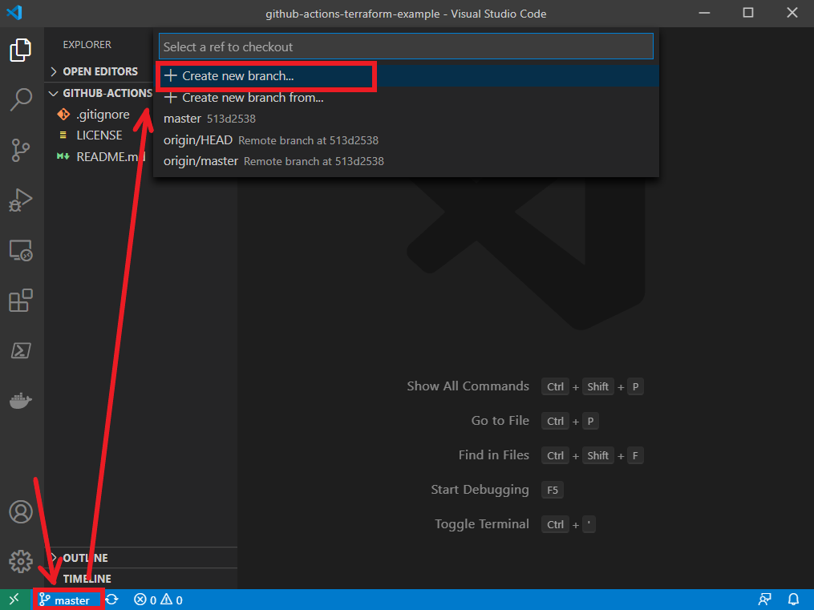

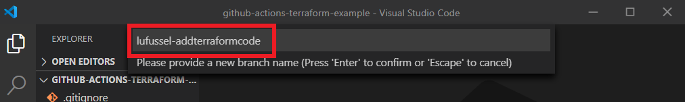

> `yourusername` as prefix, and a short name for the `issue` as a suffix is a common method for branch naming, but naming conventions are ultimately your own and should be applied consistently.

### Add Terraform configuration files

2. Add the same Terraform configuration files to the local copy of the new branch. Sample configuration files are available in the [Terraform sample](..\terraform-sample\) folder.

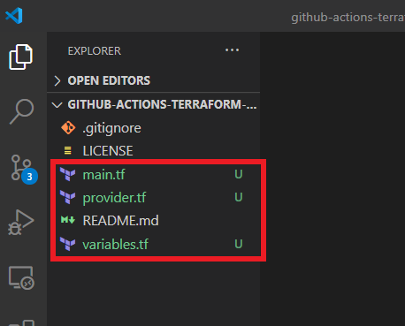

3. Update the `provider.tf` file with the correct `storage_account_name` and `container_name` created in [Lab 1](../1-prerequisites/) and save the file.

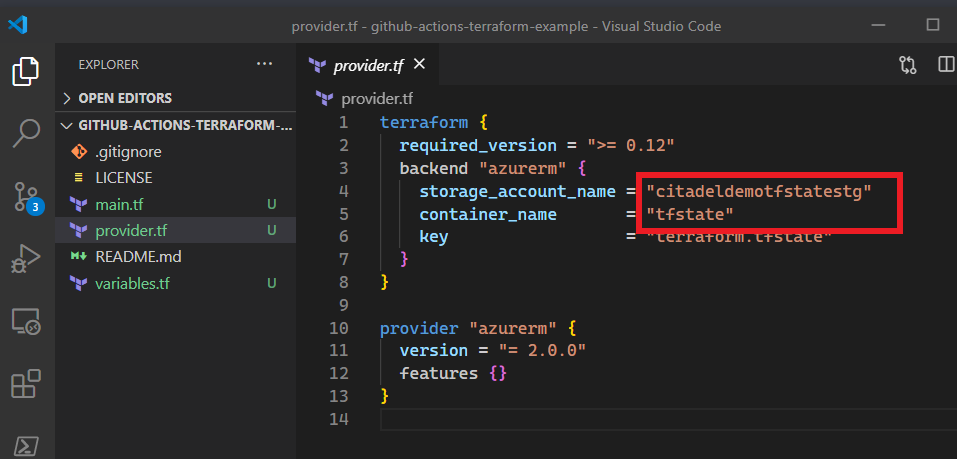

### Use a pull request to merge changes

4. From the **Source Control** tab in VS Code, stage the changes to the local branch, commit them with a short message.
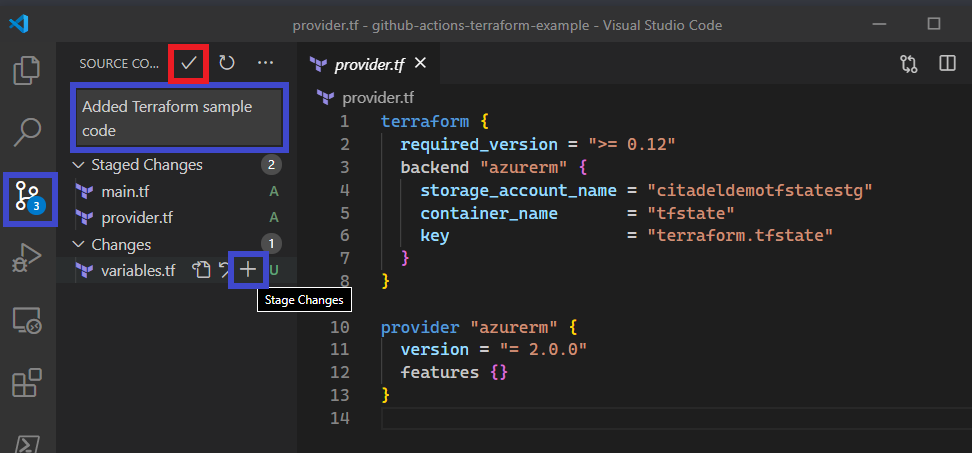

5. Publish the changes to GitHub.

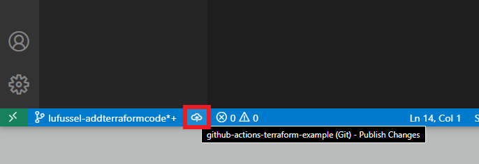

6. Return to your GitHub repository and note the recent changes pushed, and click **Compare & pull request**.

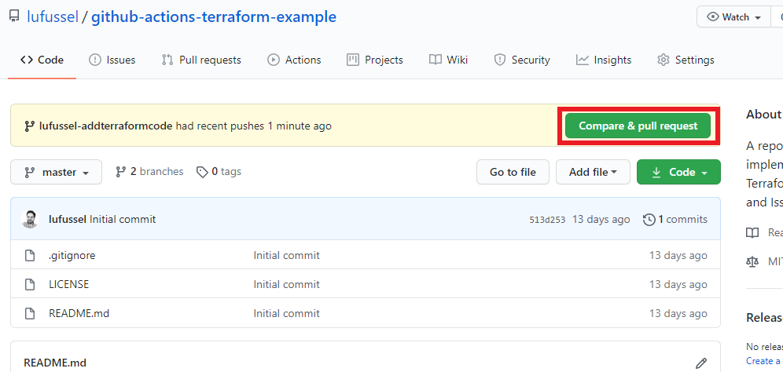

7. From the *Open a pull request* form.
- Note the branches are able to merge and can be merged automatically.
- Use the notation `Resolves #1` to associate the pull request to issue 1 (Add basic Terraform example). Pressing `#` and pausing will display all issues if your numbering does not match.
- Leave any additional comment to describe the changes in the pull request.
- Associate the project board with the pull request.
- Note the changes committed in the pull request can be viewed towards the bottom of the page.
- Click **Create pull request**.

> *Learn more about linking pull requests to issues at [GitHub Docs - Linking a pull request to an issue](https://docs.github.com/en/github/managing-your-work-on-github/linking-a-pull-request-to-an-issue).*

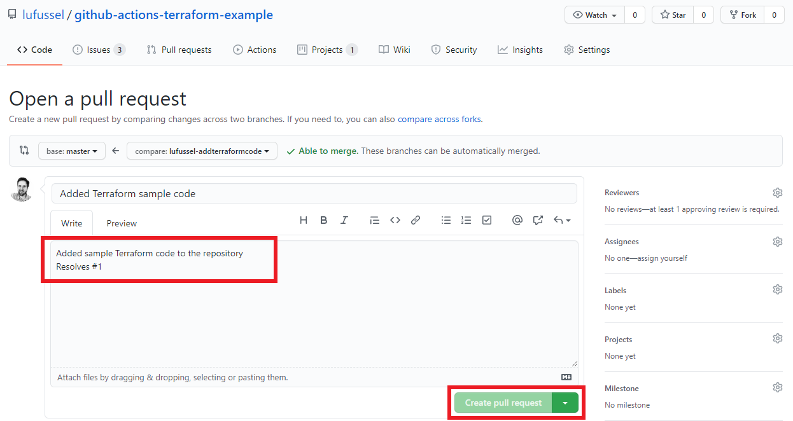

8. By linking the pull request to the project board, note that the issue has moved to *In progress* in the project board at **Projects**, **Your project name**.

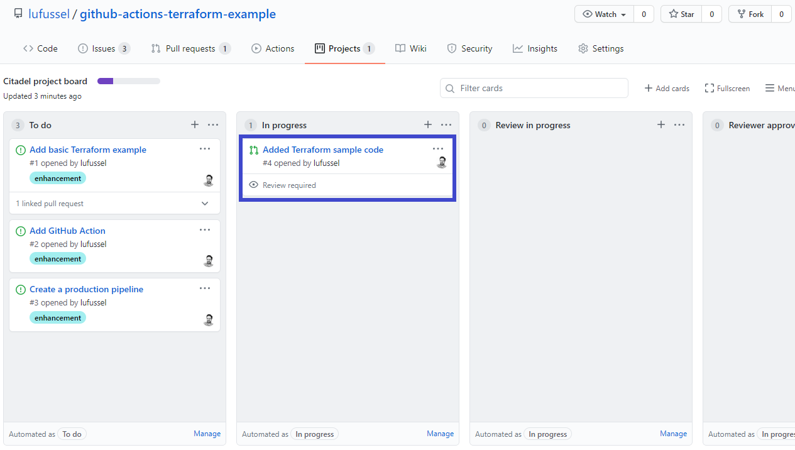

9. The pull request has now been created, click **Pull requests** and select the new pull request to see the approval form. Merging is blocked as no independent review has been completed, you may invite a collaborator to the repository, or use your admin privileges to **Merge pull request**, tick the box to awknowledge and **Confirm merge** without a review to continue the lab.

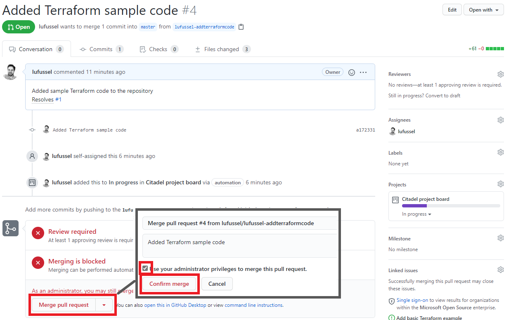

10. The **Merged** confirmation will display. The branch created for this issue is no longer required and can be safely deleted, click **Delete branch**. 

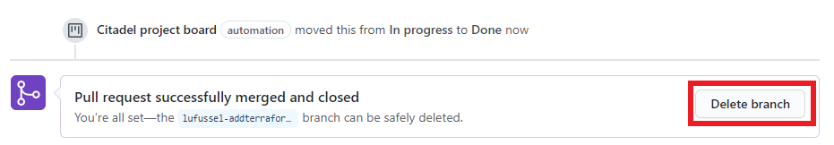

11. Review the project board at **Projects**, **Your project name**, and note the issue and pull request have moved to *Done*.

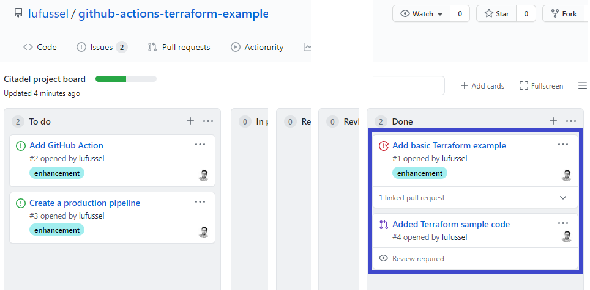

## End of Lab 4

At the end of this lab, you should have
- Created a new branch to add Terraform sample configuration
- Created a pull request to merge the new branch and associate it with an issue
- Reviewed the pull request and confirmed the merge
- Review the project board automation

Proceed to [Lab 5: Create a GitHub Action to deploy the Terraform code ](../5-create-github-action/).
